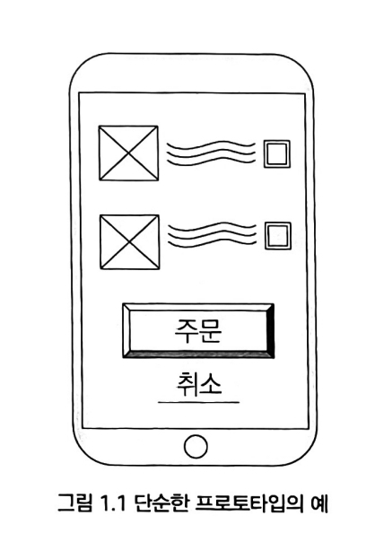
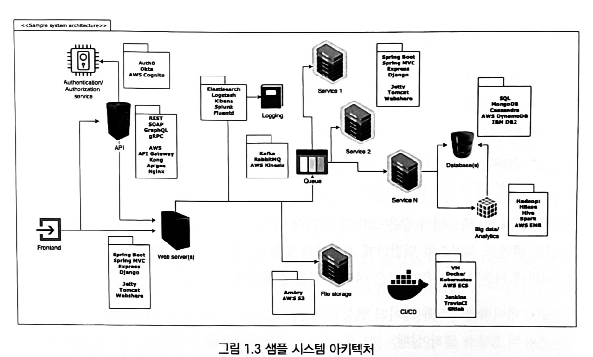

# 1. 사용자 앱 구축

# 1. 디지털 트랜스포메이션과 인터넷

## 1-1. 역사

- 2차 산업 혁명 : 전기를 통한 대량 생산
- 3차 산업 혁명 : 전자와 정보 기술을 통한 자동화
- 산업화 → 디지털화
- 디지털 시대가 시작되고 기술이 단순한 기계 이상으로 발전함에 따라 사람들의 삶과 요구 사항도 계속해서 변화함

## 1-2. 디지털 트랜스포메이션과 인터넷

### 변화하는 사회와 인터넷

- 3, 4차 산업 혁명의 구축 플랫폼 : 인터넷
- 산업의 발달 및 디지털 화로 사람들의 요구 사항은 더 복잡해지고 추상적으로 변함
- 직접적은 커뮤니티에서 거리, 시간에 제한을 받지 않은 사회 집단의 일원이 되면서 사회의 요구는 단순히 동료와 상호 작용하는 것 이상이 되었다.
- 이제는 온라인으로 음식 주문 및 결제하는 것을 더 선호하는 등 사람들의 많은 요구가 온라인을 통해서 이루어지고 있다.
- 이렇게 끊임없이 변화하는 사회의 새로운 요구 사항을 이해하는 것이 소프트웨어 개발자에게 중요하다.

### 소프트웨어의 변화

- 소프트웨어 개발 분야는 변화가 매우 심함
- 새로운 기술을 적용하고 배우는 것은 개발자의 필수 요구 사항임
- 요즘에는 인터넷 형태가 바뀌어 정적 → 동적인 플랫폼 기반으로 바뀜
- 사용자로부터 받은 정보 기반으로 가치를 제공하는 경향으로 변화됨
- 인터넷의 사용이 전문가에서 대중으로 확대되면서 소프트웨어의 규모가 커짐
  → 소비 데이터는 단일 시스템과는 맞지 않아짐
- **그럼에도 변하지 않은 것**
    - 사람들에게는 여전히 해결해야 할 문제가 있는 것

# 2. 실제 문제를 해결하기 위한 앱 설계

앱은 도구이며, 이 앱은 목적을 위한 수단이 되어야 한다.(목적 자체가 너무 추상적이나 작더라도) 개발자는 개발을 할 때 사용자가 사용하게 되는 앱을 생각하는 것보다 만들고 있는 그 자체에 집중할 때가 많은데 기술적인 곳에 집중하는 것이 아니라 사용할 만한 제대로 된 앱을 만드는 것이 우선이 되어야 한다는 것을 잊으면 안된다.
사용자가 가질 수 있는 문제(문제가 얼마나 큰지는 중요하지 않다.)를 찾고 솔루션을 찾는 것, 문제가 실제로 존재하는 것인지가 중요하다.
개발자들은 사용자의 문제보다 사용하는 기술 스택에 더 집중하는 경향이 있는데 사용자의 문제의 핵심을 놓치면 결국 실패하게 된다. 사용자는 자신이 사용하고 있는 앱이 자바로 만들어졌는지 파이썬으로 만들어졌는지 관심 없다.
`기술적인 집중보다 사용할 만한 제대로 된 앱을 만드는 것이 우선이 되어야 한다.`

## 2-2. 백엔드 개발자로서 사용자 문제 해결

- 백엔드 개발자는 사용자 관점보다는 서버, API처리 및 DB연결과 같은 보이지 않은 작업을 하기 때문에 사용자 관점의 문제를 해결하려는  근본적인 문제를 간과하기 쉽다.
- 백엔드 개발자들은 사용자들에 의해 올바르게 사용되고 있고 처리되는지 등을 알지 못한 채 일 을 하고 있을 수도 있음
- 백엔드 개발자로서 문제 해결이 소프트웨어 개발자의 지침이 되어야 하고 사용자를 잊지 말아야한다.

## 2-3. 해결해야할 문제 찾기

- 문제 해결에 집중하면 팀 리소스를 최적으로 할애할 수 있음
- 개발자들은 종종 작은 문제는 무시하는 경향이 있지만 문제의 크기로 우선순위를 정하는 것은 최적의 접근 방식이 아니다.
- 단 하나의 간단한 문제를 해결하기 위해 플젝 범위를 좁히면 다향한 솔루션을 탐색할 시간과 리소스가 많아진다.

### 개발자로서 고려할 점

- 다양성
    - 해결해야 할 문제를 찾을 때 고려할 중요한 포인트
    - Adobe Premier, Photoshop등은 전문가 대상
    - Apple등의 혁신적인 회사는 비전문가를 위한 제품 구축의 중요성을 인식하였고
      이러한 기술의 대중화로 성공할 수 있음
- 개발자는 제품의 사용자가 아니라는 점을 인식
    - 내가 생각하는 적합한 솔루션이 모든 사람에게 적합할 것이라는 생각은 오해이다.
    - 재가 생각한 솔루션이 실제 사용자들의 의견과 다를 수 있기 때문에 사용자들과 직접 대화하는 것이 중요핟.
- 사용자 기반이 얼마나 다양한지 이해하기
    - 문제를 더 쉽게 찾고 그에 맞는 솔루션을 만들기 위해서

# 3. 기능 및 비기능 요구사항 정의

## 3-1. 사용자의 요구사항

- 기능 또는 비지니스 요구사항
    - 에플리케이션의 목표
    - 클라이언트 관심 문제 및 이에 대한 추상적 솔루션
- 비기능적 요구사항
    - 기능적 요구 사항에 대해 제안 된 솔루션 구현하기 위해 필요한 시스템 요소 정의
    - ex) 필요한 서버 수, DB 종류 등

## 3-2. 효과적으로 요구 사항을 정의 하는 방법

- 고객이 자신이 원하는 것이 무엇인지 알고 있는 경우가 대부분 없다.
- 고객이 적합한 솔루션을 찾게 도와줘야한다.
- 요구 사항을 정의할 때는 최적화 해야 하는 함수가 최적화된 변수 값을 찾아가는 과정이라고 생각하면 된다.
- 일련의 제약 조건을 고려해야함
- 시스템 요구 사항은 해결해야 할 문제의 범위를 제한할 수 있는 제약 조건임

## 3-3. 요구 사항 정의 주기 및 절차

1. 아래의 주제로 하나 또는 두 개의 회의 일정 잡기
    - 고객이 해결하는 문제가 무엇인가
    - 단기, 중기, 장기 목표 및 예산 제약 등 비즈니스에 대해 자세히 파악
2. 고객의 도메인 전문가 중 한 사람에게 도움을 요청
3. 도메인 전문가와 여러 작업 세션을 예약
    - 기존 프로세스가 어떻게 작동하는지 확인
    - 고객이 현재 문제를 해결하는 방법을 이해
    - 프로토타입을 만들고 요구사항을 수정
4. 주제에 대한 전문가의 도움을 받아 프로토타입 설계와 요구 사항 정의 및 설명을 여러 번 반복

### 1-1. 고객이 해결하는 문제가 무엇인가

- 기존 비지니스를 하고 있는 고객일 경우
    - 기존 프로세스를 자동화하는 애플리케이션 구축
        - 목표 : 오류가 발생하기 쉽거나 시간이 많이 걸리는 기존 수동 프로세스를 대체해 비용 절감
    - 기존 비즈니스 프로세스에 가치를 추가해 새로운 애플리케이션 구축
        - 목표 : 새로운 기능 만들기(클라이언트의 문제 해결)
    - 기존 애플리케이션 새선
        - 목표 : 예상대로 작동하지 않거나 유지 관리 비용이 많이 드는 기존 애플리케이션 교체

### 1-2. 비즈니스에 대한 자세한 구상 파악(단,중,장기 목표 파악)

- 장기 목표 파악하는 이유
    - 고객의 비즈니스의 더 깊은 통창력을 얻음
        - 애플리케이션이 성장할 수 있는 방법을 얻음
        - 향후 비즈니스에 대한 더 나은 비전을 얻을 수 있음
        - 다른 분야의 고객의 비즈니스 기회를 얻을 수 있음
    - ex) 현 서비스가 특정 청구 서비스 공급자를 사용하고 있고 몇 년 후 다른 공급자로 이동할 계획이 있다고 하면, 시스템을 구현 할 때 기존 제공자와 밀접하게 결합하지 않게 개발함
- 예산의 한계를 이해하는 것이 중요
    - 고객이 예산을 어떻게 편성해야 할지 모를 수 있기 때문에 가이드를 제공해라
        - 시스템 목표
        - 기능적 및 비기능적 요구 사항
        - 인프라 및 소프트웨어 등을 산정
- future-proofing(미래 지향적)
    - 미래의 요구 사항을 고려하면서 애플리케이션을 구축하는 것은 미래 지향적이 아니다.
    - 불필요하게 미래 언젠가 있으면 좋은 기능을 만드는 낭비를 줄여라

### 1-3. 클라이언트의 도메인 전문가에게 도움을 요청해라

**1. 첫 회의를 마치기 전에 도메인 전문가를 알려 달라고 클라이언트에게 요청하기**

- 도메인 전문가
    - 새 앱을 사용할 것으로 예상되는 또는 기존 프로세스를 작업하는 사람들
    - 자주, 쉽게 연락할 수 있는 사람이 좋음
    - 비지니스의 부분이 어떻게 작동하는지 알려줄 수 있는 사람
    - 도메인 전문가와 긴밀이 협력하기

**2.현재 기존 프로세스가 어떻게 작동하는지 알아보기**

- 도메인 전문가의 도움을 받아 현재 사용되고 있는 클라이언트가 어떻게 작동하는지 비즈니스 운영의 세부 사항을 살펴보기
- 도메인 전문가의 작업을 직접 지켜보며 아래 질문 통해 어떻게 작동하는지 확인
    - 앱을 사용할 사람의 하루 일정
    - 어떤 장소에서 어떤 상황에 사용할 것으로 예상?
    - 현재 방식의 좋은 점, 불편한점

**3.프로토타입 제작 및 요구 사항 수정**

- 요구 사항 수집은 반복적인 과정으로 프로토타입을 제작하여 요구 사항을 수집하기
- 단순한 프로토타입을 만들어 애플리케이션의 가정이 올바른지 확인
    - 초기에 앱의 방향성을 찾는게 중요
- 프론트 엔드 개발자와 디자이너가 프로토타입을 만드는데 협력하고 담당자들 간에 질문하고 답하면 만듬
- 너무 많은 시간을 소비X
- 요구 사항은 얼마든지 바뀔 수 있는 것을 감안
- 요구 사항을 구체화, 실제 눈으로 볼 수 있는 필수 항목 위주로 포함
- 도메인 전문가와 함께 프로토타입을 검토하기
    - 피드백을 통해 프로토타입을 업데이트하는 과정을 반복
- 피드백을 통해 올바른 가정을 찾고 이를 통해 요구 사항의 의견이 모아지면 이를 문서화함

**간단한 vs 복잡한 프로토타입**

- 보통 프런트단과 디자이너가 당담하는 작업이지만 누구나 만들 수 있음
- 간단한 프로토타입은 중요한 기능만 강조하여 대략적으로 만듬
- 이이디어를 확인하고 요구 사항의 오해를 찾기 위해 프로젝트 초기에 상용하기 좋은 방식이다.
- 충실도 놓은 프로토타입은 디자이너나 개발자가 제작하는데 시간이 많이 걸리기 때문이 비용이 많이 들어서 이렇게 만드는 것을 추천하지 않는다.

# 4. 최신 시스템 설계

샘플 시스템 아키텍처는 여러 계층이 있다.

## 4-1. 프런트엔드에서 벗어나기

- 시스템 아키텍처에서는 프런트와 백엔드를 명확히 구분하지 않음
    1. 시스템 아키텍처는 전체 시스템의 전체를 나타내는 예라서
    2. 최근 프론트와 백엔드 개발자의 역할 사이의 구분선이 모호해짐

### 클라이언트 형태

- 웹 클라이언트(Chrome, Firefox 등의 브라우저)
- 모바일 애플리케이션(Android, iOS)
- Raspberry Pi, Arduino 보드 같은 기술이 내장된 사물 인터넷 장치
- 아마존 Alexa, 구글 어시스턴스와 같은 스마트 장치
- 기본 테스크톱 클라이언트

### 동적 웹 애플리케이션의 수행 작업

- 데이터베이스와 데이터 연동
- 비즈니스 로직 실행
- 데이터를 HTML로 변환
- 동적으로 생성된 HTML을 브라우저에 반환

### 비즈니스 로직 재사용 필요성 및 실행 흐름

- 다양한 기기의 사용으로 중요해짐
- 비즈니스별 논리를 게시하는 API(데이ㅌ 가져오기, 데이터 변환도 포함)
- 필요한 경우 비즈니스 API를 호출하는 프런트 엔드를 렌더링하는 웹 서버
- 웹 어플리케이션과 동일한 API를 호출하는 모바일 앱

→ 위의 분리로 프런트엔드와 백엔드 개발을 분리하는데 도움이 되었음

→ API 수준에서 백엔드와 프런트엔드를 병렬로 개발할 수 있게 되었음

## 4-2. 빌딩 블록

### 웹 서버 (2장에서 자세히)

- 클라이언트에서 또는 외부 API 계층에서 HTTP요청을 수신하는 역활
- 하나의 서버일 수 도 있고 Load Balancer 뒤에 있는 여러 서버 집합일 수 도 있음

### API 계층 (4장에서 자세히)

- 클라이언트 또는 다른 애플리케이션한테 요청 받음
- 권한 부여 서비스를 사용해 클라이언트 권한 부여와 같은 작업을 처리하는 서비스일 수 도 있음
- 자체 서버에서 실행되는 독립적인 서비스 계층일 수 도 있음
- 요청을 제한하거나 사용자에게 요금을 청구할 수 도 있음

### 분산 시스템 (11장에서 자세히)

- 대기열(큐)을 사용하는 것이 일반적임
- 서비스 간 비동기 통신을 하게 됨
- 개별 서비스가 다운될 경우 시스템에 탄력성을 제공

### 로깅 서비스 (8장에서 자세히)

- 운영 정보 저장
- 오류, 경고, 이벤트 메트릭을 나중에 분석할 수 있게 저장됨

### 애플리케이션

- 하나 또는 여러 비즈니스 서비스로 분할될 수 있음
- 논리적 또는 반물리적일 수 있음

### 데이터베이스 (4장 엔드 투 엔드에서 자세히)

- 데이터를 유지할 장소 제공
- 파일 저장소같은 서비스는 특수한 유형의 데이터 저장소

### CI/CD (10장에서 자세히)

- 컴파일하고 배포하는데 필요한 인프라 구축에 중점을 둔 방법론
