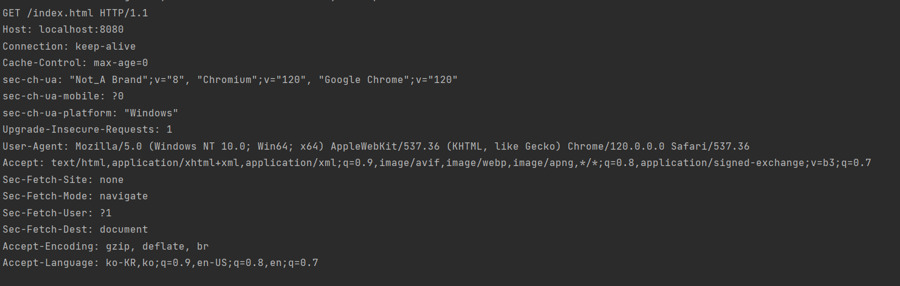

# 2. 클라이언트 서버 아키텍처

# 1. 아키텍처 세부 정보

## 1-1. Client-Server Architecture

- 서버 : 특정 기능 목표와 관련된 데이터를 저장 및 처리하는 고용량 저장 용량 및 고성능 컴퓨팅 장비
- 클라이언트 : 서버 리소스에 엑세스하는데 사용되는 장치
- 하나의 서버는 N개의 클라이언트로부터 요청 받을 수 있음
- 클라이언트-서버 아키텍처로 구현되는 예
    - 웹 인터페이스
    - FTP
        - 클라이언트 : 사용자가 파일 업로드, 다운로드할 수 있는 프로그램
        - 서버 : 파일 저장하는 서버
    - 데이터 엑세스 서비스 클라이언트, 데이터베이스 서버
        - 클라이언트 :  ODBC(Open Database Connectivity) 또는 JDBC(Java Database Connectivity)와 같은 데이터베이스 어댑터, 데이터 베이스 접속 프로그램을 사용하는 데이터 처리 서비스
        - 서버 : 데이터 베이스 서버

### 추상화 계층 : 프런트엔드 백엔드 클라이언트

- 보편적으로 클라이언트 → 사용자 화면 및 인터페이스, 서버 : 요청 기능 처리하는 기능, 이러한 클라이언트-서버 아키텍처는 단일 추상화 계층으로 그룹화 할 수  있다.
- 클라이언트 역할이 사용자 인터페이스를 포함하지만 모든 클라이언트가 직접적인 사용자 상호 작용을 포함할 필요는 없음
- 서버가 다른 서버에 요청하는 것처럼 서버도 클라이언트 역할을 하기도 함
- `사용자 인터페이스 **≠** 클라이언트`

### 추상화 계층 : 데이터 엑세스 서버스 클라이언트, 데이터베이스 서버

- RDBMS는 클라이언트-서버 아키텍처 기반, 중앙집중식 데이터 스토리지 서버
- 서버 역할이 중앙 서버에 집중됨
- 전용 데이터 저장 서버 → 성능 향상, 응용 프로그램의 신뢰할 수 있는 출처라는 일관성 보장
- Cassandra(NoSQL DB의 한 종류임)는 클러스터에 내부 P2P(클라이언트끼리 직접 통신하는)노드로 구성 되어 있음
  → 클라이언트-서버 아키텍처가 적용되지 않는 것처럼 보일 수 있음
  → but 외부 사용자 및 서비스의 관점에서 보면 피어 노드의 클러스터도 그 자체로 서버로 보임
  → `클라이언트, 서버 개념은 추상적임`

# 2. HTTP: 통신 프로토콜

## 2-1. HTTP?

- Hypertext Transfer Protocol
- 클라이언트 애플리케이션과 웹 서버 간의 통신을 가능하게 도와주는 프로토콜
- REST 및 SOAP 같은 웹 서비스 기술은 내부적으로 HTTP 기반으로 함


# 3. 웹 서버 구현

- 절차적 애플리케이션과 이벤트 기반 애플리케이션 작동 방식을 이해하기 위해 간단 웹 서버를 구축해보기
- 구현 목표
    - HTTP의 내부를 프로토콜로 보기
    - 컴파일 되고 실행되는 일반 응용 프로그램인 웹 서버의 내부 작동을 살펴보기
- 상업적으로는 사용 가능한 서버를 사용하기
- 내부가 어떻게 작동하는지 확인하기 위해 현재는 멘탈 모델을 만들어 보는 거임

## 3-1. 단일 스레드 버전의 서버

### 주요 프로세스

- 지속적으로 서버의 소켓을 읽는 무한 루프

### 코드

```java
package BackEnd.developerIn30Days.ch2;

import java.io.BufferedReader;
import java.io.IOException;
import java.io.InputStreamReader;
import java.net.ServerSocket;
import java.net.Socket;
import java.util.ArrayList;
import java.util.List;

/**
 *
 * 단일 스레드 버전 서버
 *
 */
public class MentalModServer {

    final private static int PORT = 8080;

    public static void main(String[] args) throws Exception {
				//소켓을 확인하여 요청이 이루어졌는지 확인
        try (ServerSocket serverSocket = new ServerSocket(PORT)) { 
            while (true) {
                try {
										//사용자 요청에 대한 데이터 스트림을 포함할 소켓 인스턴스 반환
                    Socket client = serverSocket.accept(); 
                    **handleClient(client);// 여기에서 브레이크 포인트**
                 }catch (Exception err) {
                    err.printStackTrace();
                }

            }
        }
    }

    private static void handleClient(Socket client) throws IOException {
        //입력 스트림 가져오기
        BufferedReader br = new BufferedReader(
                new InputStreamReader(client.getInputStream()) //바이트 스트림을 받음
        );

        List<String> requestsLines = new ArrayList<>();

        String line;

        //빈 줄을 찾을 때까지 요청의 모든 줄을 읽는다.
        do {
            line = br.readLine();
            requestsLines.add(line);
            System.out.println(line);
        } while (!line.isBlank());
    }
}
```

### 결과(브레이크 포이트 후 8080/index.html로 접속)



첫 줄에는 요청에 대한 작업과 HTTP의 버전을 나타냄 : GET 메서드로 /index.html을 호출하고 HTTP의 버전은 1.1임

그 외에는 브라우저 유형 등을 나타냄

## 3-2. 응답 제공

- 위의 코드는 클라이언트가 서버에 요청한 내용을 보여주는 코드
- 클라이언트가 서버에 요청을 하면 서버는 해당 작업을 수행하는 응답을 제공해야 함
- 응답 제공에는 2가지 작업을 수행
    - 정적 HTML 파일 변환
        - Apache 또는 nginx와 같은 클라이언트에 정적 파일을 반환하는 서버의 동작을 수행
        - 제공할 파일은 정적파일(html, javaScript, CSS, 이미지 파일 등)
    - 동적으로 생성된 HTML 파일 변환
        - Java 서블릿 , PHP 등
        - 요청에 제공된 정보를 기반으로 런타임에 응답을 작성

```java
package BackEnd.developerIn30Days.ch2;

import java.io.BufferedReader;
import java.io.IOException;
import java.io.InputStreamReader;
import java.io.OutputStream;
import java.net.ServerSocket;
import java.net.Socket;
import java.nio.file.Files;
import java.nio.file.Path;
import java.nio.file.Paths;
import java.text.SimpleDateFormat;
import java.util.ArrayList;
import java.util.Calendar;
import java.util.List;

/**
 * 단일 스레드 버전 서버
 */
public class MentalModServer {

    final private static int PORT = 8080;
    final private static String DATE_FORMAT_NOW = "yyyy-MM-dd HH:mm:ss";
    final private static String DYNAMIC = "/dynamic.html";
    final private static byte[] NOT_FOUNT_HTML = "<h1>Not found :(</h1>".getBytes();

    final private static String DIRECTORY = "/src/BackEnd/developerIn30Days/ch2";

    public static void main(String[] args) throws Exception {
        try (ServerSocket serverSocket = new ServerSocket(PORT)) {  //소켓을 확인하여 요청이 이루어졌는지 확인
            while (true) {
                try {
                    Socket client = serverSocket.accept(); //사용자 요청에 대한 데이터 스트림을 포함할 소켓 인스턴스 반환
                    handleClient(client);
                } catch (Exception err) {
                    err.printStackTrace();
                }

            }
        } catch (Exception e) {
            e.printStackTrace();
        }
    }

    private static void handleClient(Socket client) throws IOException {
        //입력 스트림 가져오기
        BufferedReader br = new BufferedReader(
                new InputStreamReader(client.getInputStream())  //바이트 스트림을 받음
        );

        List<String> requestsLines = new ArrayList<>();

        String line;

        //빈 줄을 찾을 때까지 요청의 모든 줄을 읽는다.
        System.out.println("================READ REQUESTS=====================");
        do {
            line = br.readLine();
            requestsLines.add(line);
            System.out.println(line);
        } while (line != null && !line.isBlank());

        //요청의 첫 번째 줄에서 요청된 경로를 구문 분석함
        String[] requestLine = requestsLines.get(0).split(" ");
        String path = requestLine[1];

        Path filepath = Paths.get(".", DIRECTORY + path);

        //요청의 경로가 dynamic.html인 경우 오늘 날짜 출력
        if (DYNAMIC.equals(path)) {
            sendResponse(client, "200 OK", "text/html", getDynamicResponse());
        } else if (Files.exists(filepath) && !Files.isDirectory(filepath)) {
            //그렇지 않으면 정적파일 생성
            sendResponse(client, "200 OK", Files.probeContentType(filepath), Files.readAllBytes(filepath));
        } else {
            //그렇지 않으면 오류메시지 출력
            sendResponse(client, "404 Not Found", "text/html", NOT_FOUNT_HTML);
        }

    }

    private static byte[] getDynamicResponse() {
        Calendar cal = Calendar.getInstance();
        SimpleDateFormat sdf = new SimpleDateFormat(DATE_FORMAT_NOW);
        String response = String.format(
                "<h1>Dynamic response</h1> Today is %s", sdf.format(cal.getTime())
        );
        return response.getBytes();
    }

    private static void sendResponse(Socket client, String status, String contentType, byte[] content)
            throws IOException {
        System.out.println("================SEND RESPONSE=====================");
        String LINE_BREAK = "\r\n";
        OutputStream outputStream = client.getOutputStream();
        outputStream.write(("HTTP/1.1 " + status).getBytes());
        outputStream.write(("ContentType: " + contentType + LINE_BREAK).getBytes());
        outputStream.write(LINE_BREAK.getBytes());
        outputStream.write(content);
        outputStream.write((LINE_BREAK + LINE_BREAK).getBytes());
        outputStream.flush();
        client.close();
    }
}
```
