# 2. 클라이언트 서버 아키텍처

# 1. 아키텍처 세부 정보

## 1-1. Client-Server Architecture

- 서버 : 특정 기능 목표와 관련된 데이터를 저장 및 처리하는 고용량 저장 용량 및 고성능 컴퓨팅 장비
- 클라이언트 : 서버 리소스에 엑세스하는데 사용되는 장치
- 하나의 서버는 N개의 클라이언트로부터 요청 받을 수 있음
- 클라이언트-서버 아키텍처로 구현되는 예
    - 웹 인터페이스
    - FTP
        - 클라이언트 : 사용자가 파일 업로드, 다운로드할 수 있는 프로그램
        - 서버 : 파일 저장하는 서버
    - 데이터 엑세스 서비스 클라이언트, 데이터베이스 서버
        - 클라이언트 :  ODBC(Open Database Connectivity) 또는 JDBC(Java Database Connectivity)와 같은 데이터베이스 어댑터, 데이터 베이스 접속 프로그램을 사용하는 데이터 처리 서비스
        - 서버 : 데이터 베이스 서버

### 추상화 계층 : 프런트엔드 백엔드 클라이언트

- 보편적으로 클라이언트 → 사용자 화면 및 인터페이스, 서버 : 요청 기능 처리하는 기능, 이러한 클라이언트-서버 아키텍처는 단일 추상화 계층으로 그룹화 할 수  있다.
- 클라이언트 역할이 사용자 인터페이스를 포함하지만 모든 클라이언트가 직접적인 사용자 상호 작용을 포함할 필요는 없음
- 서버가 다른 서버에 요청하는 것처럼 서버도 클라이언트 역할을 하기도 함
- `사용자 인터페이스 **≠** 클라이언트`

### 추상화 계층 : 데이터 엑세스 서버스 클라이언트, 데이터베이스 서버

- RDBMS는 클라이언트-서버 아키텍처 기반, 중앙집중식 데이터 스토리지 서버
- 서버 역할이 중앙 서버에 집중됨
- 전용 데이터 저장 서버 → 성능 향상, 응용 프로그램의 신뢰할 수 있는 출처라는 일관성 보장
- Cassandra(NoSQL DB의 한 종류임)는 클러스터에 내부 P2P(클라이언트끼리 직접 통신하는)노드로 구성 되어 있음
  → 클라이언트-서버 아키텍처가 적용되지 않는 것처럼 보일 수 있음
  → but 외부 사용자 및 서비스의 관점에서 보면 피어 노드의 클러스터도 그 자체로 서버로 보임
  → `클라이언트, 서버 개념은 추상적임`

# 2. HTTP: 통신 프로토콜

## 2-1. HTTP?

- Hypertext Transfer Protocol
- 클라이언트 애플리케이션과 웹 서버 간의 통신을 가능하게 도와주는 프로토콜
- REST 및 SOAP 같은 웹 서비스 기술은 내부적으로 HTTP 기반으로 함


# 3. 웹 서버 구현

- 절차적 애플리케이션과 이벤트 기반 애플리케이션 작동 방식을 이해하기 위해 간단 웹 서버를 구축해보기
- 구현 목표
    - HTTP의 내부를 프로토콜로 보기
    - 컴파일 되고 실행되는 일반 응용 프로그램인 웹 서버의 내부 작동을 살펴보기
- 상업적으로는 사용 가능한 서버를 사용하기
- 내부가 어떻게 작동하는지 확인하기 위해 현재는 멘탈 모델을 만들어 보는 거임

## 3-1. 단일 스레드 버전의 서버

### 주요 프로세스

- 지속적으로 서버의 소켓을 읽는 무한 루프

### 코드

```java
package BackEnd.developerIn30Days.ch2;

import java.io.BufferedReader;
import java.io.IOException;
import java.io.InputStreamReader;
import java.net.ServerSocket;
import java.net.Socket;
import java.util.ArrayList;
import java.util.List;

/**
 *
 * 단일 스레드 버전 서버
 *
 */
public class MentalModServer {

    final private static int PORT = 8080;

    public static void main(String[] args) throws Exception {
        //소켓을 확인하여 요청이 이루어졌는지 확인
        try (ServerSocket serverSocket = new ServerSocket(PORT)) { 
            while (true) {
                try {
                    //사용자 요청에 대한 데이터 스트림을 포함할 소켓 인스턴스 반환
                    Socket client = serverSocket.accept(); 
                    handleClient(client);// 여기에서 브레이크 포인트
                 }catch (Exception err) {
                    err.printStackTrace();
                }

            }
        }
    }

    private static void handleClient(Socket client) throws IOException {
        //입력 스트림 가져오기
        BufferedReader br = new BufferedReader(
                new InputStreamReader(client.getInputStream()) //바이트 스트림을 받음
        );

        List<String> requestsLines = new ArrayList<>();

        String line;

        //빈 줄을 찾을 때까지 요청의 모든 줄을 읽는다.
        do {
            line = br.readLine();
            requestsLines.add(line);
            System.out.println(line);
        } while (!line.isBlank());
    }
}
```

### 결과(브레이크 포이트 후 8080/index.html로 접속)


첫 줄에는 요청에 대한 작업과 HTTP의 버전을 나타냄 : GET 메서드로 /index.html을 호출하고 HTTP의 버전은 1.1임

그 외에는 브라우저 유형 등을 나타냄

## 3-2. 응답 제공

- 위의 코드는 클라이언트가 서버에 요청한 내용을 보여주는 코드
- 클라이언트가 서버에 요청을 하면 서버는 해당 작업을 수행하는 응답을 제공해야 함
- 응답 제공에는 2가지 작업을 수행
    - 정적 HTML 파일 변환
        - Apache 또는 nginx와 같은 클라이언트에 정적 파일을 반환하는 서버의 동작을 수행
        - 제공할 파일은 정적파일(html, javaScript, CSS, 이미지 파일 등)
    - 동적으로 생성된 HTML 파일 변환
        - Java 서블릿 , PHP 등
        - 요청에 제공된 정보를 기반으로 런타임에 응답을 작성

```java
package BackEnd.developerIn30Days.ch2;

import java.io.BufferedReader;
import java.io.IOException;
import java.io.InputStreamReader;
import java.io.OutputStream;
import java.net.ServerSocket;
import java.net.Socket;
import java.nio.file.Files;
import java.nio.file.Path;
import java.nio.file.Paths;
import java.text.SimpleDateFormat;
import java.util.ArrayList;
import java.util.Calendar;
import java.util.List;

/**
 * 단일 스레드 버전 서버
 */
public class MentalModServer {

    final private static int PORT = 8080;
    final private static String DATE_FORMAT_NOW = "yyyy-MM-dd HH:mm:ss";
    final private static String DYNAMIC = "/dynamic.html";
    final private static byte[] NOT_FOUNT_HTML = "<h1>Not found :(</h1>".getBytes();

    final private static String DIRECTORY = "/src/BackEnd/developerIn30Days/ch2";

    public static void main(String[] args) throws Exception {
        try (ServerSocket serverSocket = new ServerSocket(PORT)) {  //소켓을 확인하여 요청이 이루어졌는지 확인
            while (true) {
                try {
                    Socket client = serverSocket.accept(); //사용자 요청에 대한 데이터 스트림을 포함할 소켓 인스턴스 반환
                    handleClient(client);
                } catch (Exception err) {
                    err.printStackTrace();
                }

            }
        } catch (Exception e) {
            e.printStackTrace();
        }
    }

    private static void handleClient(Socket client) throws IOException {
        //입력 스트림 가져오기
        BufferedReader br = new BufferedReader(
                new InputStreamReader(client.getInputStream())  //바이트 스트림을 받음
        );

        List<String> requestsLines = new ArrayList<>();

        String line;

        //빈 줄을 찾을 때까지 요청의 모든 줄을 읽는다.
        System.out.println("================READ REQUESTS=====================");
        do {
            line = br.readLine();
            requestsLines.add(line);
            System.out.println(line);
        } while (line != null && !line.isBlank());

        //요청의 첫 번째 줄에서 요청된 경로를 구문 분석함
        String[] requestLine = requestsLines.get(0).split(" ");
        String path = requestLine[1];

        Path filepath = Paths.get(".", DIRECTORY + path);

        //요청의 경로가 dynamic.html인 경우 오늘 날짜 출력
        if (DYNAMIC.equals(path)) {
            sendResponse(client, "200 OK", "text/html", getDynamicResponse());
        } else if (Files.exists(filepath) && !Files.isDirectory(filepath)) {
            //그렇지 않으면 정적파일 생성
            sendResponse(client, "200 OK", Files.probeContentType(filepath), Files.readAllBytes(filepath));
        } else {
            //그렇지 않으면 오류메시지 출력
            sendResponse(client, "404 Not Found", "text/html", NOT_FOUNT_HTML);
        }

    }

    private static byte[] getDynamicResponse() {
        Calendar cal = Calendar.getInstance();
        SimpleDateFormat sdf = new SimpleDateFormat(DATE_FORMAT_NOW);
        String response = String.format(
                "<h1>Dynamic response</h1> Today is %s", sdf.format(cal.getTime())
        );
        return response.getBytes();
    }

    private static void sendResponse(Socket client, String status, String contentType, byte[] content)
            throws IOException {
        System.out.println("================SEND RESPONSE=====================");
        String LINE_BREAK = "\r\n";
        OutputStream outputStream = client.getOutputStream();
        outputStream.write(("HTTP/1.1 " + status).getBytes());
        outputStream.write(("ContentType: " + contentType + LINE_BREAK).getBytes());
        outputStream.write(LINE_BREAK.getBytes());
        outputStream.write(content);
        outputStream.write((LINE_BREAK + LINE_BREAK).getBytes());
        outputStream.flush();
        client.close();
    }
}
```

# 3. 멀티스레딩을 통한 다중 사용자 지원

비동기 실행이 어려워 코드에 10초 강제 지연을 추가 후 시간을 출력해보기

```java
package BackEnd.developerIn30Days.ch2;

public class MentalModServer {
		//..
    public static void main(String[] args) throws Exception {
        //...
    }

    private static void handleClient(Socket client) throws IOException, InterruptedException {
				//추가 코드
        Thread.sleep(10000);
        System.out.println(" Current time in seconds: " + Instant.now().getEpochSecond());

        //...이전 코드
    }
}
```

**cmd에서 두번 연속 호출**


**결과**

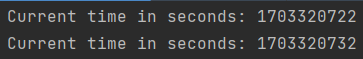

- 동시에 요청 가능하게 됨
- 요청 간의 차이가 10초
- 이전 요청이 완료될 때까지 대기함 : 이전 요청이 완료될 때까지 대기열에서 대기함
- 이 코드에서는 동시에 여러 사용자 요청을 처리하지 않음

**→ 이를 위해 서버를 멀티스레딩으로 확장함 (java의 Runnable 인터페이스 확장**

### 멀티스레딩 확장

**ServerHandler.java**

```java
package BackEnd.developerIn30Days.ch2;

import java.io.BufferedReader;
import java.io.IOException;
import java.io.InputStreamReader;
import java.io.OutputStream;
import java.net.Socket;
import java.nio.file.Files;
import java.nio.file.Path;
import java.nio.file.Paths;
import java.text.SimpleDateFormat;
import java.time.Instant;
import java.util.ArrayList;
import java.util.Calendar;
import java.util.List;

public class ServerHandler implements Runnable{

    final private static String DYNAMIC = "/dynamic.html";
    final private static byte[] NOT_FOUNT_HTML = "<h1>Not found :(</h1>".getBytes();

    final private static String DIRECTORY = "/src/BackEnd/developerIn30Days/ch2";

    final private static String DATE_FORMAT_NOW = "yyyy-MM-dd HH:mm:ss";
    
    private final Socket client;

    public ServerHandler(Socket client) {
        //생성시 socket 전달
        this.client = client;
    }

    @Override
    public void run() {

        System.out.println(" Current time in seconds: " + Instant.now().getEpochSecond());

        //입력 스트림 가져오기
        BufferedReader br;
        //바이트 스트림을 받음
        try {

            br = new BufferedReader(new InputStreamReader(client.getInputStream()));
            List<String> requestsLines = new ArrayList<>();

            String line;
            //빈 줄을 찾을 때까지 요청의 모든 줄을 읽는다.
            do {
                line = br.readLine();
                requestsLines.add(line);
            } while (line != null && !line.isBlank());

            //요청의 첫 번째 줄에서 요청된 경로를 구문 분석함
            String[] requestLine = requestsLines.get(0).split(" ");
            String path = requestLine[1];

            Path filepath = Paths.get(".", DIRECTORY + path);

            //요청의 경로가 dynamic.html인 경우 오늘 날짜 출력
            if (DYNAMIC.equals(path)) {
                sendResponse(client, "200 OK", "text/html", getDynamicResponse());
            } else if (Files.exists(filepath) && !Files.isDirectory(filepath)) {
                //그렇지 않으면 정적파일 생성
                sendResponse(client, "200 OK", Files.probeContentType(filepath), Files.readAllBytes(filepath));
            } else {
                //그렇지 않으면 오류메시지 출력
                sendResponse(client, "404 Not Found", "text/html", NOT_FOUNT_HTML);
            }
        } catch (IOException e) {
            e.printStackTrace();
        }
    }

    private static byte[] getDynamicResponse() {
        Calendar cal = Calendar.getInstance();
        SimpleDateFormat sdf = new SimpleDateFormat(DATE_FORMAT_NOW);
        String response = String.format(
                "<h1>Dynamic response</h1> Today is %s", sdf.format(cal.getTime())
        );
        return response.getBytes();
    }

    private static void sendResponse(Socket client, String status, String contentType, byte[] content)
            throws IOException {
        String LINE_BREAK = "\r\n";
        OutputStream outputStream = client.getOutputStream();
        outputStream.write(("HTTP/1.1 " + status).getBytes());
        outputStream.write(("ContentType: " + contentType + LINE_BREAK).getBytes());
        outputStream.write(LINE_BREAK.getBytes());
        outputStream.write(content);
        outputStream.write((LINE_BREAK + LINE_BREAK).getBytes());
        outputStream.flush();
        client.close();
    }
}
```

**HttpServerMultiThread.java**

```java
package BackEnd.developerIn30Days.ch2;

import java.net.ServerSocket;
import java.net.Socket;
import java.util.concurrent.Executors;
import java.util.concurrent.ThreadPoolExecutor;

public class HttpServerMultiThread {

    static ThreadPoolExecutor executorService = (ThreadPoolExecutor) Executors.newCachedThreadPool();

    final private static int PORT = 8080;

    public static void main(String[] args) throws Exception {
        try (ServerSocket serverSocket = new ServerSocket(PORT)) {
            while (true) {
                try {
                    Socket client = serverSocket.accept();
                    //별도의 스레드에서 ServerHandler의 실행 함수 호출
                    executorService.submit(new ServerHandler(client));
                } catch (Exception e) {
                    e.printStackTrace();
                }
            }
        }
    }
}
```

### 결과

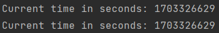

- 두 요청 간의 시간 차이가 1초 미만으로 줄어 듬

# 4. 운영 서버 준비

## 4-0. javaScript 기본 문법 및 express 기초

변수 선언

- var : 재 선언 가능
- let : 재 선언 불가, 재할당  가능
- const : 재선언, 재할당 불가

**express란**

- node.js 위에서 동작하는 웹 프레임워크
- 미들웨어 구조
- 자바스크립트로 작성된 다양한 미들웨어는 개발자가 필요한 것만 선택하여 express와 결합해 사용할 수 있음

```jsx
const express = require('express')
const app=express()
app.get('/',(req,res)=>res.send('Hello World!'))
app.listen(3000, ()=> console.log('Example app listening on port 3000'))
```

`const app = express()` : express를 함수처럼 호출하고 리턴된 값을 app에 넣음

여기서 리턴된 값은 Application 객체, 이 객체가 가지고 있는 메소드가 get, llisten

## 4-1. express로 서버 생성

### 1. 설정

1. node.js 설치
2. npm 초기화
   초기화 할 폴더에서 npm init 후 나오는 질문에 엔터치면서 넘어가도 됨
   entry point만 파일 이름으로 입력(여기선 server.js 로)

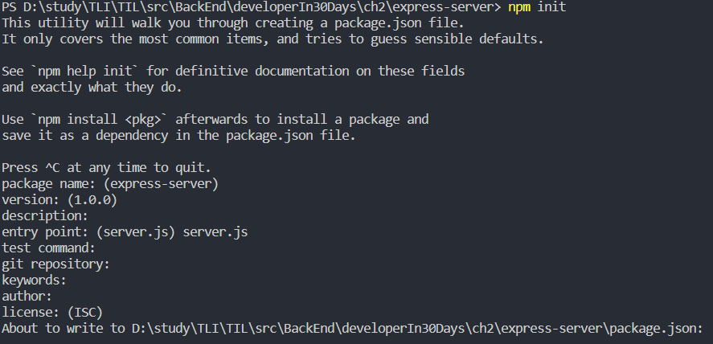

이후 해당 폴더에 package.json파일 생성된거 확인됨

1. express 라이브러리 다운

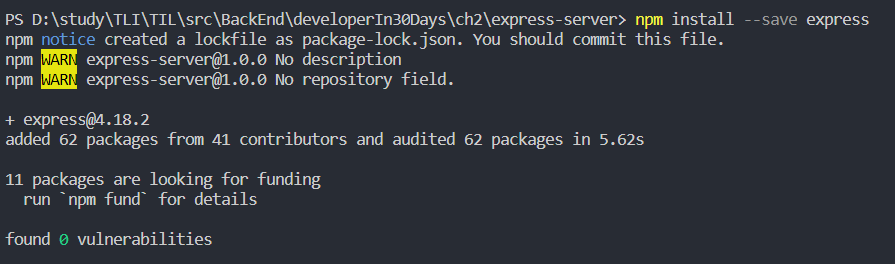

이 후 해당 폴더에 패키지 다운된 폴더 확인

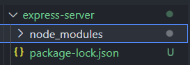

### 2. Server.js

```jsx
const express = require("express");
const app = express();
const port = 8080;

//use(가상 경로, static 폴더)
// localhost:8080/statci/img/1.png 는 public/img/1.png와 같음
// 정적 파일이 호스팅 되는 폴더에 대한 매핑임
app.use("/static", express.static("public"));

app.get("/", (req, res) => {
    res.send("<h1>Hello Wold!</h1>");
});

app.post("/", function (req, res) {
    res.send("Got a POST request");
});

app.listen(port, () => {
    console.log(`App listenting at http://localhodt:${port}`);
});
```

- Express는 이벤트 기반 프로그래밍 접근 방식을 사용
- 요청을 받거나 서버가 시작될 때 등 다양한 이벤트에서 실행할 콜백함수를 정의함
- 구문 분석을 처리 하고 결과 개체를 핸들러 함수로 전달(입력 스트림을 수동으로 구문 분석할 필요 없음)
- 문자열을 바이트로 변환하지 않고 res.send()를 이용해 처리
- 정적 파일을 렌더링 하기 위해 `app.use(...)`를 사용
- 응답 압축을 바로 사용할 수 있는 미들웨어 제공
  → 클라이언트가 정적 파일을 요청할 때 서버가 해당 파일을 자동으로 찾아 제공할 수 있음

### 3. 실행 및 결과

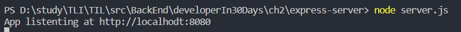


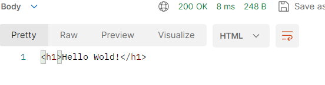


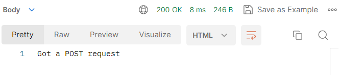

## 4-2. Express에서  HTTPS 활성화

**HTTP**

- HTTP의 요청과 응답은 클라이언트 서버 사이 전송되는 일반 텍스트
- 이런 택스트는 패킷 스니퍼와 같은 도구로 노출될 수 있음

**HTTPS**

HTTPS는 HTTP보다 안전한 통신을 제공하기 위해 암호화된 체널을 사용한다.

HTTPS를 구현하기 위해서 RFC 7230과 같은 요구 사항 목록을 따르는 것이 필요한다. 이런 요구 사항을 충족하기 위해서 SSL인증서를 사용해야 한다. SSL인증서는 서버의 신뢰성에 대한 정보를 클라이언트에 제공하고 이는 인증 기관에서 검증한 ID정보를 포함함

**SSL 인증서 받기**

- OpenSSL 사용
    - 자체 서명된 인증서를 만드는 방법
    - 무료
    - 인증서가 보장되지 않은 사설인증일경우 경고를 브라우저에서 표시할 수 있음
    - 테스트, 디버깅 용도에 적합
- 공인 SSL인증서 구입(도메인용 SSL인증서)
    - 간단
    - 키 파일 제공
    - 비용 발생
    - 운영, 배포에 적합

### 코드

인증서 생성 후 실행

```jsx
var express = require("express");
var fs = require("fs");
var https = require("https");
var app = express();

app.get("/", function (req, res) {
    res.send("Hello Wold!");
});

https
    .createServer(
        {
            key: fs.readFileSync('key파일위치'),
            cert: fs.readFileSync('cert파일위치')
        },
        app
    )
    .listen(3000, function () {
        console.log(
            "Example app listening on port 3000! Go to https://localhost:3000/"
        );
    });
```

# 5. 계층화된 아키텍처: 서버에서 클라이언트를 완전히 분리

## 5-1. 계층화된 아키텍처 예시 및 설명

- 웹 서버가 데이터 저장 및 처리, 애플리케이션 HTML 렌더링 담당
- PHP 같은 기술을 사용해 동적 웹 애플리케이션 구축 가능

### 코드

DB에서 제품 목록을 쿼리하고 결과가 포함된 테이블로 HTML페이지를 만들어 보여주는 코드

```php
<?php
	$servername = "localhost";
	$suer = "johndoe";
	$pass = "Admin123";
	$dbname = "products_db";
	
	//데이터베이스에 연결
	$conn = new mysqli($servername, $user, $pass, $dbname);
	
	$query = "SELECT id, product_title, product_description FROM Products";
	$query_result = $coon->query($query);
	
	if($query_result->num_rows > 0) {
		echo "<h1> Products </h1>"
		echo "<table>"
		echo "<tr><th>ID</th> <th>Title</th> <th>Decription</th></tr>";
		//각 행의 출력 데이터
		while($row = !query_result->fetch_assoc()) {
			echo "<tr><td>".$row["id"]."</td><td>".$row["product_
		title"]." ".$row["product_description"]."</td></tr>";
		}
		echo <"/table>";
	} else {
		echo "No products to display";
	}
	$conn->close();
?>
```

**코드 설명**

- product 테이블에서 이름 목록으 검색하도록 MySQL 데이터 베이스에 요청
- 쿼리에서 결과 목록을 검색
- 결과 목록이 비어있으면 No products to display를 표시하고, 결과가 있는 경우 동적으로 HTML테이블을 생성하고 표시
- 생성된 HTML을 반환

### 계층화된 아키텍처

위의 방식은 사용자 지정 웹 서버나 Express서버에서 사용되는 방식과 달리 절차적인 방식을 채택하여 사용(PHP와 같은 스크립트 언어들)

위와 같이 여러 스크립트로 구성된 애플리케이션을 유지보수할 경우 프레젠테이션 계층과 비즈니스 계층간의 강력한 결합이 있어서 프런트와 백엔드 개발자가 함께 작업해야하는 부분이 있어 협업이 어려울 수 있음

만약 이와같이 운영하는 경우 단일 스크립트가 아닌 여러 파일로 분할해 각각의 관심사를 명확하게 구분할 수 있게 구성하는 것이 좋음

이런 종류의 스크립트를 만약 모바일 앱을 지원하려면 → 애플리케이션을 다시 빌드하거나 완전히 다른 것을 빌드해야할 수 있음

이런 프런트 엔드와 백엔드 사이의 강력한 결합을  해결하는 한 가지 접근 방식이 `계층화된 아키텍처를 사용하는 것`

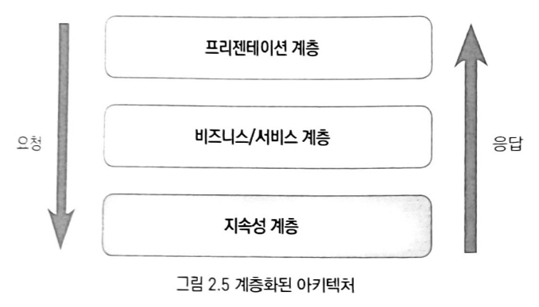

- 프리젠테이션 계층 : 최종 사용자가 데이터를 표시하고 형식화하는 데 필요한 코드
- 비즈니스/서비스 계층 : 데이터를 원하는 형식으로 변환, 기능 요구사항을 충족시키는 코드
- 지속성 계층 : 외부 데이터 저장소와 상호 작용, 데이터 저장 및 검색 관련된 코드

### 패턴의 적용

계층화된 아키텍처는 모든 프로젝트에 적합하지 않을 수 있다. 특히 배포, 확장성과 같은 작업이 번거로운 모놀리식 애플리케이션에서는 더욱 그러하다.

하지만 클라이언트-서버 애플리케이션을 구축할 때는 매우 유용하다.

아키텍처 패턴을 구현할 때는 유연성을 유지하면서 특정 사례에 적합한 아키텍처 개념을 적용하는 것이 중요하다.

코드를 어떻게 분할하고 어떤 아키텍처를 적용할지는 사용하는 기술, 프레이워크, 언어 등에 따라 달라진다. 핵심은 팀이 서로 방해받지 않고 독립적으로 작업할 수 있게 코드를 분할 하는 것이다.

## 5-2. 클라이언트 분할

프리젠테이션 계층과 비즈니스 계층 간의 분리는 프리젠테이션 코드를 위해 계층을 독립적으로 가질 수 있다는 이점과 프리젠티이션 계층을 웹 서버에서 완전히 분리할 수도 있다는 이점이 있다.

최신 클라이언트 애플리케이션 개발에서 프리젠테이션 코드와 서버 코드가 독립적으로 빌드 및 매포되는 경우가 많음

- 자체 웹서버에 배포된 React, Angular와 같은 도구를 사용하는 웹 애플리케이션 프로젝트
- iOS용 Swift 또는 Android용 Kotlin과 같은 도구로 만든 네이티브 모바일 애플리케이션

위와 같은 분리는 개발자들이 서로 다른 계층에 집중하여 작업할 수 있고 프로젝트의 생산성과 유지 보수성을 향상시키는 데 도움이 되는 등 전반적으로 프로젝트 진행을 원할하게 해줌

## 5-3. 클아이언트 VS 서버 컴퓨팅

**Q : 최신 클라이언트와 현재 서버의 성능을 고려할 때 애플리케이션 처리 작업의 대부분을 어디에서 수행해야하는가?**

**A : 상황에 따라 다르다.**

### 처리 작업을 클라이언트 쪽으로 이동하는 경우

- **장점**
    - 대기 시간 단축 : 서버에 요청할 필요가 없으므로 네트워크 호출에 사용되는 시간을 절약, 사용자 경험을 향상
    - 서버 부하 감소 : 서버 성능 향상, 더 많은 클라이언트 지원 가능
    - 개인 정보 보호 증가 : 개인 정보가 장치를 벗어나지 않기 때문에 민감한 개인 데이터를 더 쉽게 처리할 수 있음, 트래픽 암호화와 같은 문제에 대해 걱정할 필요가 없음
- **단점**
    - 낮은 일관성 : 특정 민감한 작업(ex:은행 거래)에는 높은 일관성이 요구되고, 다른 모든 사용자의 정보와 일치해야 하므로 클라이언트 장치에서 이러한 종류의 트랜잭션을 완전히 수행하는 것을 불가능
    - 엑세스 제어 문제 : 사용자 장치에 안전하게 보낼 수 없는 특정 리소스가 있을 수 있고, 운영을 위해 시스템 내 다른 사용자의 민감한 정보가 필요할 수 있으며, 이는 서버에서만 안전하게 운영될 수 있다.
    - 성능 문제 : 일부 작업은 클라이언트 장치에서 수행되기에 복잡하거나 자원과 시간을 많이 소비할 수 있음
    - 버전 다양성 : 모든 클라이언트 장치가 동일한 클라이언트 버전을 실행하는 것은 아님. 그래서 모든 클라이언트가 동일한 기능 세트를 사용할 수 있는 것이 아니다. 비슷한 예로 예전의 브라우저 호환성 문제가 있다.
    - 다양한 클라이언트 성능 : 버전 조각화와 유사하게 모든 장치에 메모리 집약적인 작업을 수행할 수 있는 컴퓨팅 성능이 있는 것이 아니다. 또 클라이언트로 작업을 전환할 수록 더 많은 전력이 필요해 모바일 장치의 배터리 문제가 발생할 수 있음

  ### 비지니스로직을 클라이언트로 이동하는 작업

  비지니스 로직을 클라이언트로 이동하는 작업은 필요에 따라 수행해야한다. 실용적인 방법은 서버에 모든 비즈니스로직을 배치하는 것을 시작으로 천천히 일부 로직을 클라이언트로 옮기는 것이 좋다.

  가장 큰 성능 향상을 가져오는 기능들 (주로 네트워크 대기 시간이 오래 걸리는데에 의해 제한되고 실행하는데 많은 처리 능력이 필요하지 않은 기능)을 위주로 옮기는 등 반복적인 개선 작업을 통해 사용자에게 긍정적인 영향을 미치는 개선점에 도달할 수 있을 것이다.


# 6. 상태 비저장(stateless) 서비스로서의 웹 서버

## 6-1. 상태 비저장

- HTTP는  stateless 방식
    - HTTP 서버는 상태 정보를 저장하지 않음
    - 서버는 클라이언트가  이전에 요청을 수행했는지 또 다른 요청과 관련되어 있는지 여부를 기억하지 않음
- 서버는 각각의 요청을 독립적으로, 동시에 처리할 수 있음
- 클라이언트와 서버 간에 자유롭게 상호 작용이 가능해져 더 나은 성능과 가용성 제공
    - 더 나은 성능 : 동일한 웹 응용 프로그램을 실행하는 여러 서버로 클러스터를 만들 수 있다. 그 후 로드 밸런서를 앞에 배치해 클라이언트 요청을 여러 서버로 분산하여 보낼 수있다. 이렇게 하면 각 서버가 처리하는 작업 부하를 분산 시키고 서버가 처리하는 요청 수를 줄일 수 있음
    - 더 나은 가용성 : 상태 비저장 서버 클러스터가 있는 경우 서버 하나가 실패하면 백업에 대한 걱정 없이 새 서버로 교체 할 수 있음 → 서비스 중단 시간을 최소화 할 수 있음

### stateless 서버 세션 추적 방법

서버가 Stateless인 경우 세션을 추적하기 위해 쿠키, 인증 토큰 등 몇 가지 방법들이 있다. 이런 방법 들은 모두 클라이언트와 서버 간의 데이터 교환을 통해 상태를 유지하여 HTTP 서버는 stateless 상태를 유지하면서도 사용자 세션을 추적할 수 있다.

- **쿠키**
    - 쿠키를 이용해 각 요청에서 세션 토큰을 전송하여 사용자 세션을 추적
    - 클라이언트 측에서 쿠키를 저장
    - 서버는 각 요청에서 쿠키를 읽어 세션 토큰을 파악하고 해당 세션에 대한 처리를 수행
- **인증 토큰**
    - 서버가 각 요청에서 인증 토큰을 받도록하는 API를 호출
    - 클라이언트은 각 요청에서 토큰을 전송함
    - 서버는 토큰의 유효성을 검사하여 해당 요청에 대한 처리를 수행
    - RESTful API에서 많이 사용됨

> 💡 **세션, 쿠키 따로 정리**
>

## 6-2. 세션 데이터 저장

세션은 쿠키보다 보안에 뛰어나 로그인과 같이 보안 상 중요한 작업을 할 때 사용한다.

- 사용자가 웹 브라우저를 통해 웹 서버에 접속한 시점으로부터 웹 브라우저를 종료하는 시점까지 같은 사용자로 부터 오는 일련의 요청을 하나의 상태로 보고 그 상태를 유지
- 세션은 메모리 또는 로컬 파일, DB등에 저장되기도 한다.

### Sticky Session의 발생 이유

대용량 트래픽 장애를 없애기 위해 서버에 적절히 트랙픽을 분배하는 로드 밸런서를 사용할 경우 세션에 대한 문제가 생긴다.

**발생 문재**

Client가 로그인 요청을 A서버로 보낸 후 A서버는 Client의 로그인 정보를 저장하게 된다.
→ 그 후 Client는 로그인 성공 응답을 받고 로드 밸런서에게 새로운 요청을 보낸다
→ 이 요청은 서버 C로 전달되고
→ C서버 세션에는 이 사용자의 로그인 정보가 없어 요청 실패하게 된다.

**→ 위의 문재를 보안하기 위해 나온게 `Sticky Session`**

### Sticky Session

- 첫 요청 이후의 모든 요청은 특정 서버로 고정하는 방법으로 세션을 관리
- Sticky Session을 유지하기 위해 Cookie나 클라이언트 IP를 tracking하는 방법을 사용한다.

**단점**

- 로드 밸런싱을 의도한대로 잘 동작하지 않을 수 있음
- 특정 서버만 과부하가 올 수 있음
- 특정 서버 Fail시 해당 서버에 붙어있는 세션들이 모두 소실될 수 있음

### Sticky Session 단점 보안

1. Session들을 하나로 묶어 클러스터로 관리

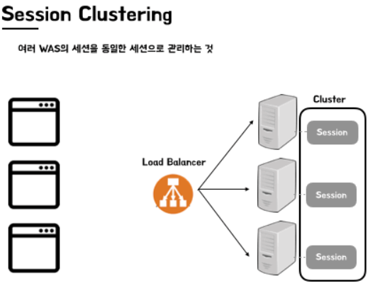

1. Session Server 분리

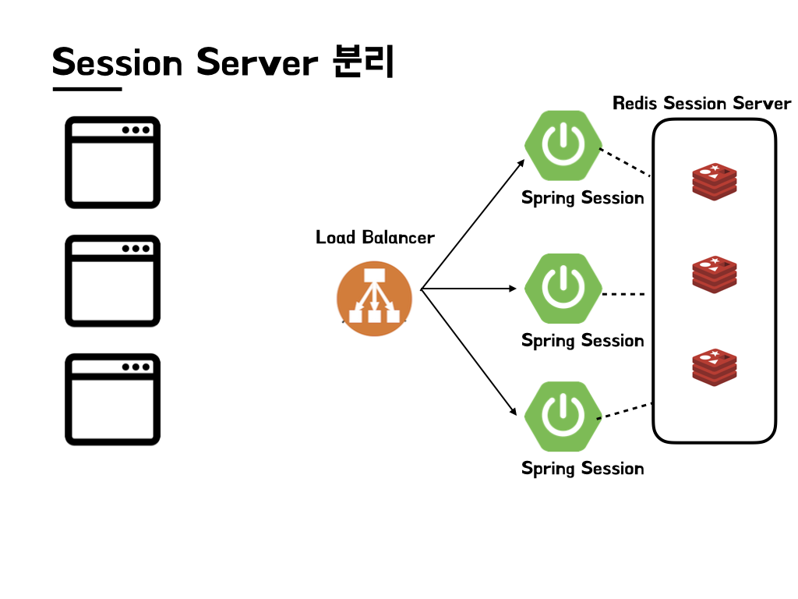

---

참고

[Sticky Session](https://kchanguk.tistory.com/146)
